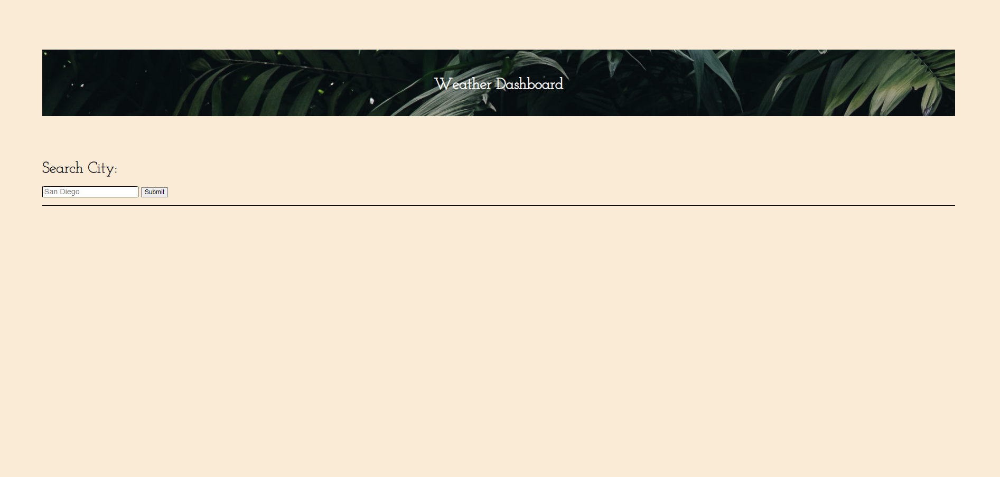
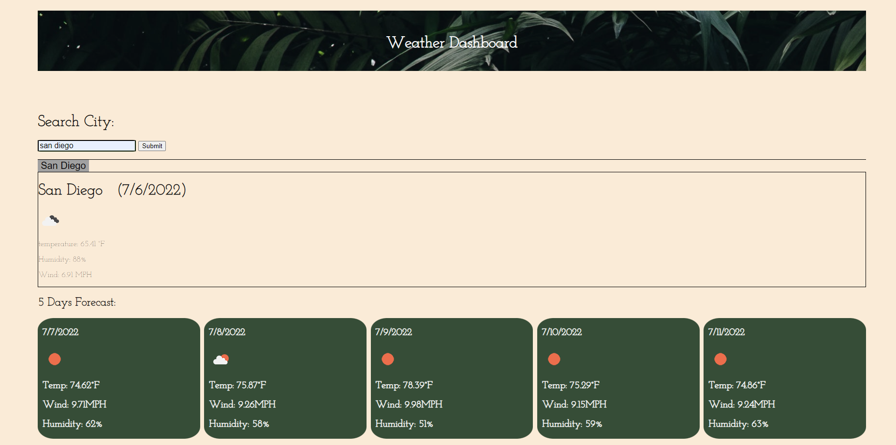

# Weather-Dashboard Website

The weather dashboard website allows users to search any city's current and future weather conditions.

The user is presented with a 5-day forecast that displays the date, an icon representing weather conditions, the temperature, the wind speed, and the humidity.

Whenever you search for a city, this one is added to the search history box.

 ## Usage

### Mock-Up

